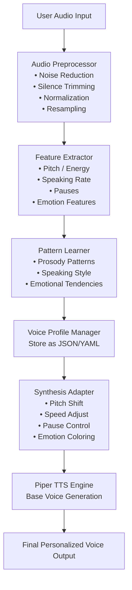
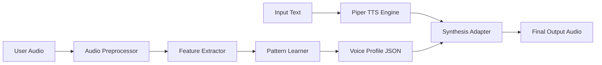
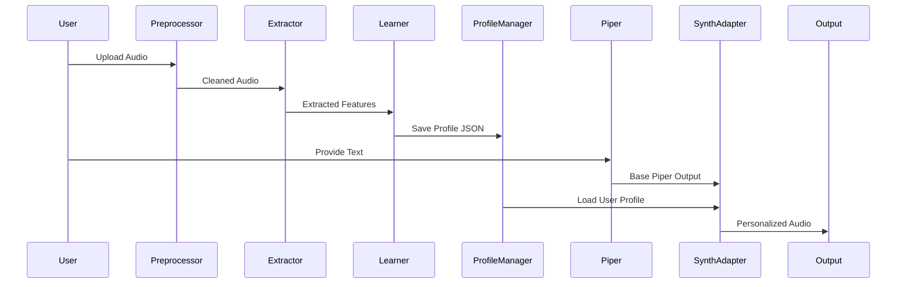
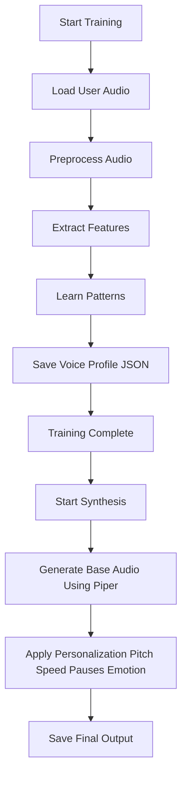
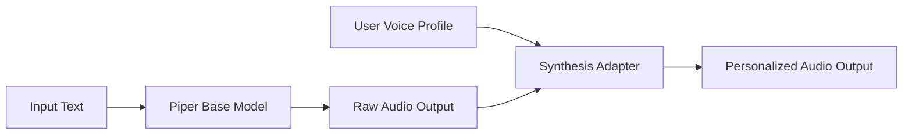

# 📊 DIAGRAMS – Piper TTS Personalization Engine

This document contains all architecture and workflow diagrams required for the Piper personalization project.  
All diagrams are written in **Mermaid** format and compatible with GitHub markdown.

---

# 🔹 1. System Architecture Diagram

---

# 🔹 2. Data Flow Diagram (DFD – Level 1)

---

# 🔹 3. Component Interaction Diagram

---

# 🔹 4. Personalization Workflow Diagram

---

# 🔹 5. Piper Integration Diagram

---

# ✅ END OF DIAGRAMS.md
