# 📊 DIAGRAMS – Piper TTS Personalization Engine

This document contains all architecture and workflow diagrams required for the Piper personalization project.  
All diagrams are written in **Mermaid** format and compatible with GitHub markdown.

---

# 🔹 1. System Architecture Diagram

```mermaid
flowchart TD
    A[User Audio Input] --> B[Audio Preprocessor<br/>• Noise Reduction<br/>• Silence Trimming<br/>• Normalization<br/>• Resampling]
    B --> C[Feature Extractor<br/>• Pitch / Energy<br/>• Speaking Rate<br/>• Pauses<br/>• Emotion Features]
    C --> D[Pattern Learner<br/>• Prosody Patterns<br/>• Speaking Style<br/>• Emotional Tendencies]
    D --> E[Voice Profile Manager<br/>Store as JSON/YAML]
    E --> F[Synthesis Adapter<br/>• Pitch Shift<br/>• Speed Adjust<br/>• Pause Control<br/>• Emotion Coloring]
    F --> G[Piper TTS Engine<br/>Base Voice Generation]
    G --> H[Final Personalized Voice Output]
```

---

# 🔹 2. Data Flow Diagram (DFD – Level 1)

---

# 🔹 3. Component Interaction Diagram

---

# 🔹 4. Personalization Workflow Diagram

---

# 🔹 5. Piper Integration Diagram

---

# ✅ END OF DIAGRAMS.md
